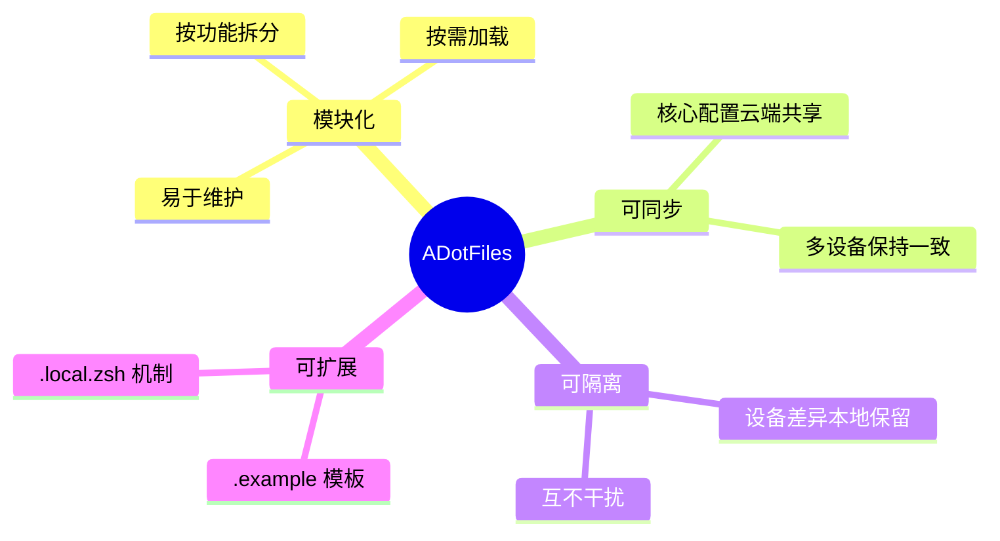
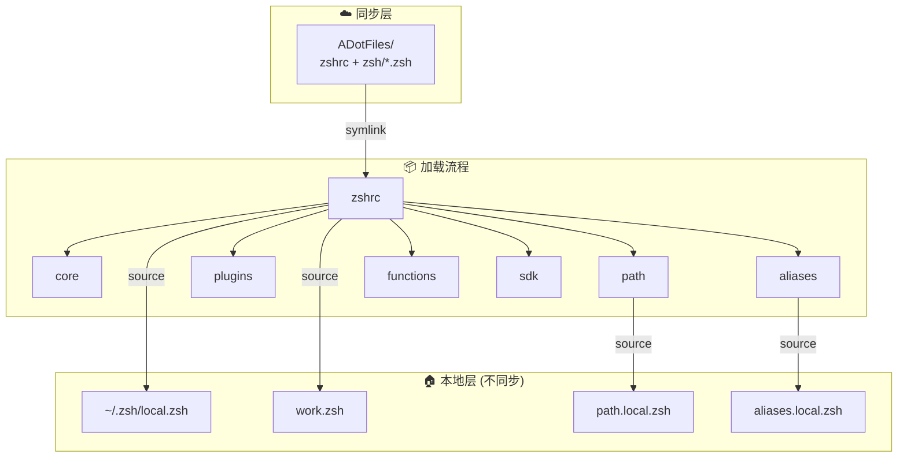
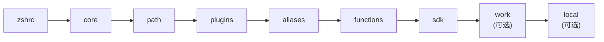

# ADotFiles

> 模块化 Zsh 配置框架，支持多设备同步与本地隔离

[English](./README_EN.md) | 简体中文

<!-- Badges: Core -->
[](LICENSE)
[](https://github.com/ArnoFrost/ADotFiles/releases)
[]()
[]()

<!-- Badges: Tech Stack -->
[](https://github.com/romkatv/powerlevel10k)
[](https://brew.sh)
[]()

> **Latest: [v1.0.0](https://github.com/ArnoFrost/ADotFiles/releases/tag/v1.0.0)** · [查看更新日志](docs/CHANGELOG.md)

---

## ⚡ 特性

| 特性 | 说明 |
|:-----|:-----|
| 📦 **模块化** | 按功能拆分，按需加载，易于维护 |
| ☁️ **可同步** | 支持 iCloud / Git / Dropbox / Syncthing |
| 🏠 **可隔离** | 设备差异本地保留，互不干扰 |
| 🔌 **可扩展** | `.local.zsh` + `.example` 模板机制 |
| ⚡ **懒加载** | NVM / SDKMAN / Conda 按需加载 |
| 🛠️ **CLI 工具** | `adot` 命令一键管理 |

---

## 📖 设计理念



## 🏗 架构



## 🎯 适用场景

**✅ 适用：**
- 使用多台设备，希望配置保持一致
- 需要在不同设备有差异化配置
- 喜欢模块化、可维护的配置结构

**❌ 不适用：**
- 非 Zsh 用户
- 偏好单文件配置
- 需要跨 Linux/macOS 完全统一 (本项目偏向 macOS)

## 🚀 快速开始

```bash
# 1. 克隆仓库
git clone https://github.com/ArnoFrost/ADotFiles.git ~/ADotFiles

# 2. 安装
cd ~/ADotFiles && bash setup.sh install

# 3. 重载
source ~/.zshrc
```

## ☁️ 同步方案

本框架不强绑定特定同步方式，以下方案均可：

| 方案 | 适用场景 | 配置 |
|------|----------|------|
| **iCloud** | macOS 多设备 | 克隆到 `~/Library/Mobile Documents/com~apple~CloudDocs/` |
| **Git** | 跨平台、版本控制 | 直接 clone，手动 pull/push |
| **Dropbox** | 跨平台自动同步 | 克隆到 Dropbox 目录 |
| **Syncthing** | 自建同步 | 配置同步目录 |

## 📁 模块说明

```
ADotFiles/
├── setup.sh                     # CLI 工具 (adot)
├── zshrc                        # 入口，加载各模块
├── p10k.zsh                     # Powerlevel10k 主题
└── zsh/
    ├── core.zsh                 # 核心 (历史、补全、选项)
    ├── path.zsh                 # PATH 环境变量
    ├── plugins.zsh              # 插件加载
    ├── aliases.zsh              # 通用别名
    ├── functions.zsh            # 通用函数
    ├── sdk.zsh                  # SDK 懒加载 (NVM/SDKMAN/Conda)
    │
    ├── path.local.zsh.example   # 个人路径扩展模板
    ├── aliases.local.zsh.example # 个人别名扩展模板
    ├── work.zsh.example         # 工作配置模板
    └── local.zsh.template       # 本地配置模板
```

### 模块加载顺序



## 🛠 CLI 命令

```bash
adot install     # 完整安装 (链接 + 依赖)
adot deps        # 仅安装依赖
adot doctor      # 诊断检查
adot status      # 链接状态

adot unlink      # 取消链接
adot uninstall   # 完全卸载
adot restore     # 从备份恢复

adot pull        # 拉取更新
adot sync        # 同步到远程
```

## ⚙️ 扩展指南

### 添加个人配置

```bash
# 1. 从模板创建
cp zsh/path.local.zsh.example zsh/path.local.zsh
cp zsh/aliases.local.zsh.example zsh/aliases.local.zsh

# 2. 编辑个人配置
vim zsh/path.local.zsh

# 3. 重载生效
source ~/.zshrc
```

### 本地配置 (~/.zsh/local.zsh)

```zsh
# 设备标识
export DEVICE_NAME="MacBook-Pro"

# 模块开关
ADOT_LOAD_SDK=false

# 本机专属
alias proj="cd ~/MyProjects"
```

## 📋 依赖

- [Homebrew](https://brew.sh) (macOS)
- [Powerlevel10k](https://github.com/romkatv/powerlevel10k) (可选但推荐)

自动安装的工具：`eza` `bat` `autojump` `zsh-autosuggestions` `zsh-syntax-highlighting`

## ⚠️ 已知局限

- **偏向 macOS** - 依赖检测和安装基于 Homebrew
- **Zsh 专用** - 不支持 Bash/Fish
- **同步冲突** - 多设备同时编辑可能冲突，建议单向同步

## 📝 关于

一套个人 dotfiles 设计方案，核心的**模块化设计**和**本地隔离机制**具有一定参考价值。欢迎 Fork 后根据自己的需求调整。

> 📋 **[查看完整更新日志](docs/CHANGELOG.md)** | 🏷️ **[所有版本](https://github.com/ArnoFrost/ADotFiles/releases)**

---

<p align="center">
  <sub>Made with ❤️ by <a href="https://github.com/ArnoFrost">Arno</a></sub>
</p>

## 📄 License

[MIT](LICENSE)
