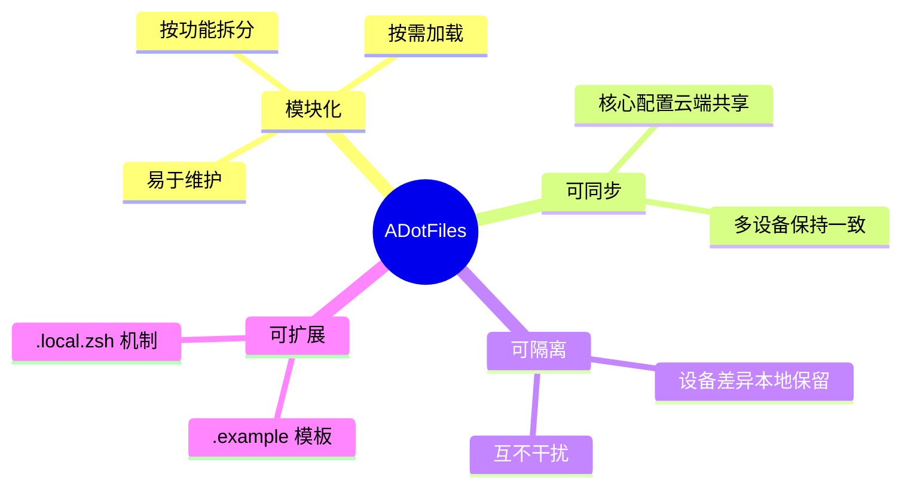
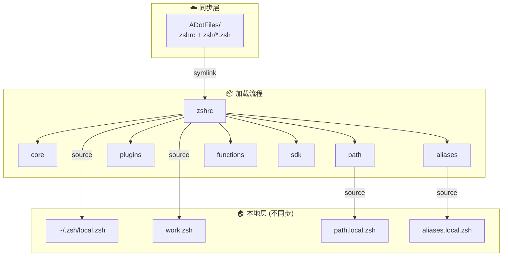
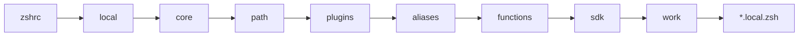

<div align="center">

# ADotFiles

**模块化 Zsh 配置框架，支持多设备同步与本地隔离**

[English](./README_EN.md) | 简体中文

[](https://github.com/ArnoFrost/ADotFiles/stargazers)
[](https://github.com/ArnoFrost/ADotFiles/network)
[](https://github.com/ArnoFrost/ADotFiles/commits)
[](LICENSE)
[](https://github.com/ArnoFrost/ADotFiles/releases)

[]()
[]()
[](https://github.com/romkatv/powerlevel10k)
[](https://brew.sh)

<p>
  <a href="#-快速开始">快速开始</a> •
  <a href="#-架构">架构</a> •
  <a href="#-cli-命令">命令</a> •
  <a href="#-同步方案">同步</a> •
  <a href="./docs/CHANGELOG.md">更新日志</a>
</p>

</div>

---

<details>
<summary>📖 目录 / Table of Contents</summary>

- [特性](#-特性)
- [设计理念](#-设计理念)
- [架构](#-架构)
- [适用场景](#-适用场景)
- [快速开始](#-快速开始)
- [同步方案](#-同步方案)
- [模块说明](#-模块说明)
- [CLI 命令](#-cli-命令)
- [本地配置](#-本地配置)
- [迁移指南](#-迁移指南)
- [依赖](#-依赖)
- [已知局限](#-已知局限)

</details>

---

## ⚡ 特性

| 特性 | 说明 |
|:---:|---|
| 📦 | **模块化** - 按功能拆分，按需加载，易于维护 |
| ☁️ | **可同步** - 支持 iCloud / Git / Dropbox / Syncthing |
| 🏠 | **可隔离** - 设备差异本地保留，互不干扰 |
| 🔌 | **可扩展** - `~/.zsh/local.zsh` 本地配置机制 |
| ⚡ | **懒加载** - NVM / SDKMAN / Conda 按需加载 |
| 🛠️ | **CLI 工具** - `adot` 命令一键管理 |

---

## 📖 设计理念


```mermaid
mindmap
  root((ADotFiles))
    模块化
      按功能拆分
      按需加载
      易于维护
    可同步
      核心配置云端共享
      多设备保持一致
    可隔离
      设备差异本地保留
      互不干扰
    可扩展
      .example 模板
      .local.zsh 机制
```

---

## 🏗 架构


```mermaid
flowchart TB
    subgraph Sync["☁️ 同步层"]
        REPO["ADotFiles/<br/>zshrc + zsh/*.zsh"]
    end
    
    subgraph Load["📦 加载流程"]
        direction LR
        ZSHRC["zshrc"] --> CORE["core"]
        ZSHRC --> PATH["path"]
        ZSHRC --> PLUGINS["plugins"]
        ZSHRC --> ALIASES["aliases"]
        ZSHRC --> FUNCTIONS["functions"]
        ZSHRC --> SDK["sdk"]
    end
    
    subgraph Local["🏠 本地层 (不同步)"]
        LOCAL["~/.zsh/local.zsh"]
        WORK["work.zsh"]
        PATH_L["path.local.zsh"]
        ALIAS_L["aliases.local.zsh"]
    end
    
    REPO -->|symlink| ZSHRC
    PATH -->|source| PATH_L
    ALIASES -->|source| ALIAS_L
    ZSHRC -->|source| WORK
    ZSHRC -->|source| LOCAL
```

### 模块加载顺序


```mermaid
flowchart LR
    A["zshrc"] --> B["local"] --> C["core"] --> D["path"]
    D --> E["plugins"] --> F["aliases"] --> G["functions"]
    G --> H["sdk"] --> I["work"] --> J["*.local.zsh"]
```

---

## 🎯 适用场景

- **适用**：多台设备配置同步、需要设备差异化配置、喜欢模块化可维护结构
- **不适用**：非 Zsh 用户、偏好单文件配置、需要跨 Linux/macOS 完全统一

---

## 🚀 快速开始

```bash
# 1. 克隆仓库
git clone https://github.com/ArnoFrost/ADotFiles.git ~/ADotFiles

# 2. 安装
cd ~/ADotFiles && bash setup.sh install

# 3. 重载
source ~/.zshrc
```

---

## ☁️ 同步方案

本框架不强绑定特定同步方式，以下方案均可：

| 方案 | 适用场景 | 配置 |
|------|----------|------|
| **iCloud** | macOS 多设备 | 克隆到 `~/Library/Mobile Documents/com~apple~CloudDocs/` |
| **Git** | 跨平台、版本控制 | 直接 clone，手动 pull/push |
| **Dropbox** | 跨平台自动同步 | 克隆到 Dropbox 目录 |
| **Syncthing** | 自建同步 | 配置同步目录 |

---

## 📁 模块说明

```text
ADotFiles/
├── setup.sh                     # CLI 工具 (adot)
├── zshrc                        # 入口，加载各模块
├── p10k.zsh                     # Powerlevel10k 主题
└── zsh/
    ├── core.zsh                 # 核心 (历史、补全、选项)
    ├── path.zsh                 # PATH 环境变量
    ├── plugins.zsh              # 插件加载
    ├── aliases.zsh              # 通用别名
    ├── functions.zsh            # 通用函数
    ├── sdk.zsh                  # SDK 懒加载 (NVM/SDKMAN/Conda)
    └── local.zsh.template       # 本地配置模板
```

---

## 🛠 CLI 命令

| 命令 | 说明 |
|------|------|
| `adot install` | 完整安装 (链接 + 依赖) |
| `adot deps` | 仅安装依赖 |
| `adot doctor` | 诊断检查 |
| `adot status` | 链接状态 |
| `adot unlink` | 取消链接 |
| `adot uninstall` | 完全卸载 |
| `adot restore` | 从备份恢复 |
| `adot pull` | 拉取更新 |
| `adot sync` | 同步到远程 |

---

## 🏠 本地配置

所有本机特有配置集中在 `~/.zsh/` 目录，不会同步到云端：

```text
~/.zsh/
├── local.zsh            # 主配置 (设备标识、PATH、别名、环境变量)
├── aliases.local.zsh    # 本机别名 (可选)
└── path.local.zsh       # 本机 PATH (可选)
```

### 创建本地配置

```bash
# 1. 创建目录
mkdir -p ~/.zsh

# 2. 从模板创建
cp ~/ADotFiles/zsh/local.zsh.template ~/.zsh/local.zsh

# 3. 编辑配置
code ~/.zsh/local.zsh  # 或 vim ~/.zsh/local.zsh

# 4. 重载生效
source ~/.zshrc
```

### 配置示例

```zsh
# ~/.zsh/local.zsh

# 设备标识
export DEVICE_NAME="MacBook-Pro-Work"

# 模块开关
ADOT_LOAD_SDK=true
ADOT_LOAD_WORK=true

# 本机 PATH
export PATH="$HOME/.codebuddy/bin:$PATH"

# 本机别名
alias sublime="'/Applications/Sublime Text.app/Contents/SharedSupport/bin/subl'"
alias subz="sublime ~/.zshrc"
alias sp="scrcpy"

# 代理设置
# export http_proxy="http://127.0.0.1:7890"
```

---

## 🔄 迁移指南

### 从旧 ~/.zshrc 迁移

1. **安装 ADotFiles**
   ```bash
   git clone https://github.com/ArnoFrost/ADotFiles.git ~/ADotFiles
   cd ~/ADotFiles && bash setup.sh install
   ```

2. **查看旧配置备份**
   ```bash
   ls ~/.adot_backup/        # 查看所有备份
   adot restore              # 交互式恢复
   ```

3. **迁移本机配置到 ~/.zsh/local.zsh**
   - 本机特有的 PATH 设置
   - 本机特有的别名
   - 本机特有的环境变量
   - 代理设置

4. **验证**
   ```bash
   source ~/.zshrc
   adotstatus
   ```

### 多设备同步

| 设备 | 操作 |
|------|------|
| **主力机** | 安装后正常使用，配置同步到云端 |
| **新设备** | 克隆仓库 → 运行 setup.sh → 创建 local.zsh |

> 💡 每台设备的 `~/.zsh/local.zsh` 需要单独创建，这正是"本地隔离"的设计目的

---

## 📋 依赖

- [Homebrew](https://brew.sh) (macOS)
- [Powerlevel10k](https://github.com/romkatv/powerlevel10k) (可选但推荐)

自动安装的工具：`eza` `bat` `zoxide` `zsh-autosuggestions` `zsh-syntax-highlighting`

---

## ⚠️ 已知局限

- **偏向 macOS** - 依赖检测和安装基于 Homebrew
- **Zsh 专用** - 不支持 Bash/Fish
- **同步冲突** - 多设备同时编辑可能冲突，建议单向同步

---

## 📝 关于

一套个人 dotfiles 设计方案，核心的**模块化设计**和**本地隔离机制**具有一定参考价值。欢迎 Fork 后根据自己的需求调整。

> 📋 **[查看完整更新日志](docs/CHANGELOG.md)** | 🏷️ **[所有版本](https://github.com/ArnoFrost/ADotFiles/releases)**

## 📄 License

[MIT](LICENSE)

---

<div align="center">

Made with ❤️ by [ArnoFrost](https://github.com/ArnoFrost)

[](https://github.com/ArnoFrost)

</div>
