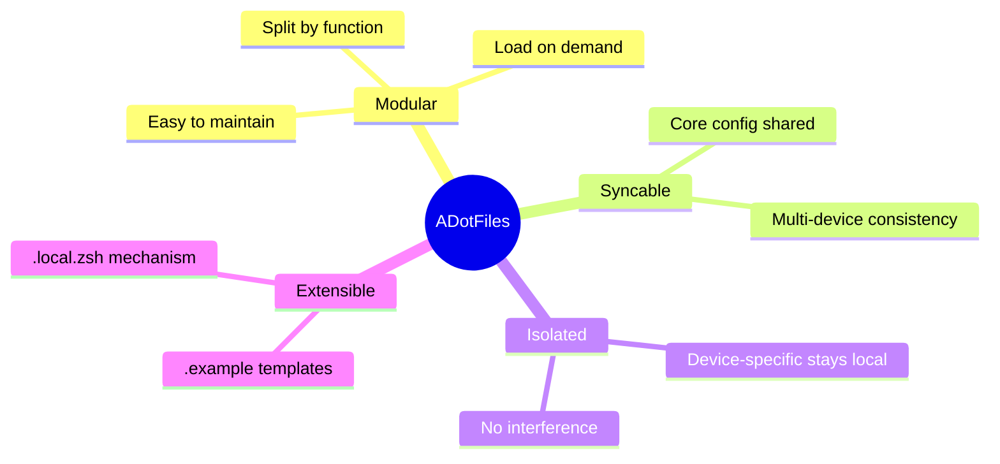
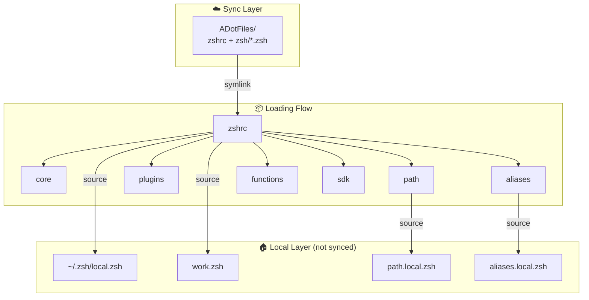
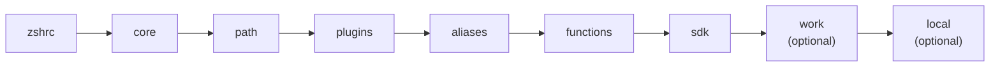

<div align="center">

# ADotFiles

**A modular Zsh configuration framework with multi-device sync and local isolation**

English | [简体中文](./README.md)

[](https://github.com/ArnoFrost/ADotFiles/stargazers)
[](https://github.com/ArnoFrost/ADotFiles/network)
[](https://github.com/ArnoFrost/ADotFiles/commits)
[](LICENSE)
[](https://github.com/ArnoFrost/ADotFiles/releases)

[]()
[]()
[](https://github.com/romkatv/powerlevel10k)
[](https://brew.sh)

<p>
  <a href="#-quick-start">Quick Start</a> •
  <a href="#-architecture">Architecture</a> •
  <a href="#-cli-commands">Commands</a> •
  <a href="#-sync-options">Sync</a> •
  <a href="./docs/CHANGELOG.md">Changelog</a>
</p>

</div>

---

<details>
<summary>📖 Table of Contents</summary>

- [Features](#-features)
- [Design Philosophy](#-design-philosophy)
- [Architecture](#-architecture)
- [Use Cases](#-use-cases)
- [Quick Start](#-quick-start)
- [Sync Options](#-sync-options)
- [Module Overview](#-module-overview)
- [CLI Commands](#-cli-commands)
- [Extension Guide](#-extension-guide)
- [Requirements](#-requirements)
- [Known Limitations](#-known-limitations)

</details>

---

## ⚡ Features

| Feature | Description |
|:---:|---|
| 📦 | **Modular** - Split by function, load on demand, easy to maintain |
| ☁️ | **Syncable** - iCloud / Git / Dropbox / Syncthing supported |
| 🏠 | **Isolated** - Device-specific stays local, no interference |
| 🔌 | **Extensible** - `.local.zsh` + `.example` template mechanism |
| ⚡ | **Lazy Load** - NVM / SDKMAN / Conda on-demand loading |
| 🛠️ | **CLI Ready** - `adot` command for one-click management |

---

## 📖 Design Philosophy



---

## 🏗 Architecture



### Module Loading Order



---

## 🎯 Use Cases

- **Suitable for**: Multi-device config sync, device-specific customizations, modular maintainable structure
- **Not suitable for**: Non-Zsh users, single-file config preference, full Linux/macOS parity needed

---

## 🚀 Quick Start

```bash
# 1. Clone
git clone https://github.com/ArnoFrost/ADotFiles.git ~/ADotFiles

# 2. Install
cd ~/ADotFiles && bash setup.sh install

# 3. Reload
source ~/.zshrc
```

---

## ☁️ Sync Options

This framework doesn't lock you into any specific sync method:

| Method | Best For | Setup |
|--------|----------|-------|
| **iCloud** | macOS multi-device | Clone to `~/Library/Mobile Documents/com~apple~CloudDocs/` |
| **Git** | Cross-platform, version control | Clone anywhere, manual pull/push |
| **Dropbox** | Cross-platform auto-sync | Clone to Dropbox folder |
| **Syncthing** | Self-hosted sync | Configure sync directory |

---

## 📁 Module Overview

```text
ADotFiles/
├── setup.sh                     # CLI tool (adot)
├── zshrc                        # Entry point, loads modules
├── p10k.zsh                     # Powerlevel10k theme
└── zsh/
    ├── core.zsh                 # Core (history, completion, options)
    ├── path.zsh                 # PATH variables
    ├── plugins.zsh              # Plugin loading
    ├── aliases.zsh              # Common aliases
    ├── functions.zsh            # Common functions
    ├── sdk.zsh                  # SDK lazy loading (NVM/SDKMAN/Conda)
    └── local.zsh.template       # Local config template
```

---

## 🛠 CLI Commands

| Command | Description |
|---------|-------------|
| `adot install` | Full install (link + deps) |
| `adot deps` | Install dependencies only |
| `adot doctor` | Run diagnostics |
| `adot status` | Show link status |
| `adot unlink` | Unlink configs |
| `adot uninstall` | Full uninstall |
| `adot restore` | Restore from backup |
| `adot pull` | Pull updates |
| `adot sync` | Push to remote |

---

## ⚙️ Extension Guide

### Local Config (~/.zsh/local.zsh)

```zsh
# Device identifier
export DEVICE_NAME="MacBook-Pro"

# Module toggles
ADOT_LOAD_SDK=false

# Device-specific
alias proj="cd ~/MyProjects"
```

---

## 📋 Requirements

- [Homebrew](https://brew.sh) (macOS)
- [Powerlevel10k](https://github.com/romkatv/powerlevel10k) (optional but recommended)

Auto-installed tools: `eza` `bat` `autojump` `zsh-autosuggestions` `zsh-syntax-highlighting`

---

## ⚠️ Known Limitations

- **macOS-leaning** - Dependency detection based on Homebrew
- **Zsh only** - No Bash/Fish support
- **Sync conflicts** - Simultaneous edits may conflict; one-way sync recommended

---

## 📝 About

A personal dotfiles design. The core **modular design** and **local isolation mechanism** may serve as useful reference. Feel free to fork and adapt to your needs.

> 📋 **[Full Changelog](docs/CHANGELOG.md)** | 🏷️ **[All Releases](https://github.com/ArnoFrost/ADotFiles/releases)**

## 📄 License

[MIT](LICENSE)

---

<div align="center">

Made with ❤️ by [ArnoFrost](https://github.com/ArnoFrost)

[](https://github.com/ArnoFrost)

</div>
