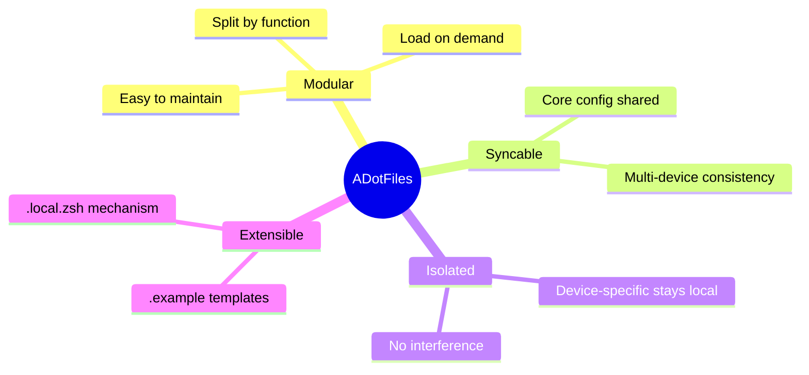
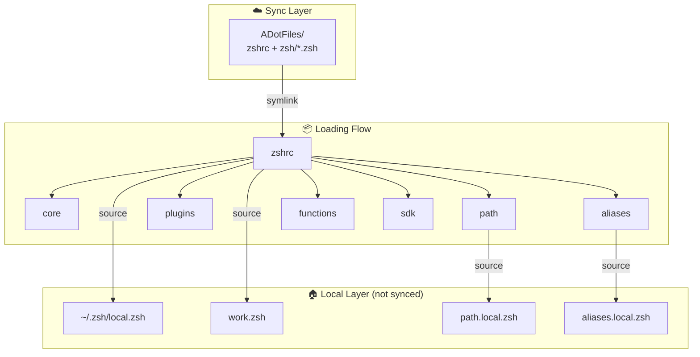
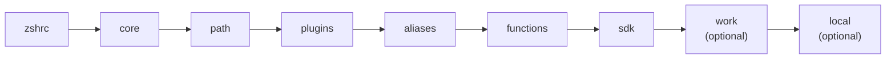

# ADotFiles

> A modular Zsh configuration framework with multi-device sync and local isolation

English | [简体中文](./README.md)

[](LICENSE)
[](docs/CHANGELOG.md)
[]()

## 📖 Design Philosophy



## 🏗 Architecture



## 🎯 Use Cases

**✅ Suitable for:**
- Multiple devices, want consistent config
- Need device-specific customizations
- Prefer modular, maintainable structure

**❌ Not suitable for:**
- Non-Zsh users
- Prefer single-file config
- Need full Linux/macOS parity (this project leans macOS)

## 🚀 Quick Start

```bash
# 1. Clone
git clone https://github.com/ArnoFrost/ADotFiles.git ~/ADotFiles

# 2. Install
cd ~/ADotFiles && bash setup.sh install

# 3. Reload
source ~/.zshrc
```

## ☁️ Sync Options

This framework doesn't lock you into any specific sync method:

| Method | Best For | Setup |
|--------|----------|-------|
| **iCloud** | macOS multi-device | Clone to `~/Library/Mobile Documents/com~apple~CloudDocs/` |
| **Git** | Cross-platform, version control | Clone anywhere, manual pull/push |
| **Dropbox** | Cross-platform auto-sync | Clone to Dropbox folder |
| **Syncthing** | Self-hosted sync | Configure sync directory |

## 📁 Module Overview

```
ADotFiles/
├── setup.sh                     # CLI tool (adot)
├── zshrc                        # Entry point, loads modules
├── p10k.zsh                     # Powerlevel10k theme
└── zsh/
    ├── core.zsh                 # Core (history, completion, options)
    ├── path.zsh                 # PATH variables
    ├── plugins.zsh              # Plugin loading
    ├── aliases.zsh              # Common aliases
    ├── functions.zsh            # Common functions
    ├── sdk.zsh                  # SDK lazy loading (NVM/SDKMAN/Conda)
    │
    ├── path.local.zsh.example   # Personal paths template
    ├── aliases.local.zsh.example # Personal aliases template
    ├── work.zsh.example         # Work config template
    └── local.zsh.template       # Local config template
```

### Module Loading Order



## 🛠 CLI Commands

```bash
adot install     # Full install (link + deps)
adot deps        # Install dependencies only
adot doctor      # Run diagnostics
adot status      # Show link status

adot unlink      # Unlink configs
adot uninstall   # Full uninstall
adot restore     # Restore from backup

adot pull        # Pull updates
adot sync        # Push to remote
```

## ⚙️ Extension Guide

### Add Personal Config

```bash
# 1. Create from template
cp zsh/path.local.zsh.example zsh/path.local.zsh
cp zsh/aliases.local.zsh.example zsh/aliases.local.zsh

# 2. Edit personal config
vim zsh/path.local.zsh

# 3. Reload
source ~/.zshrc
```

### Local Config (~/.zsh/local.zsh)

```zsh
# Device identifier
export DEVICE_NAME="MacBook-Pro"

# Module toggles
ADOT_LOAD_SDK=false

# Device-specific
alias proj="cd ~/MyProjects"
```

## 📋 Requirements

- [Homebrew](https://brew.sh) (macOS)
- [Powerlevel10k](https://github.com/romkatv/powerlevel10k) (optional but recommended)

Auto-installed tools: `eza` `bat` `autojump` `zsh-autosuggestions` `zsh-syntax-highlighting`

## ⚠️ Known Limitations

- **macOS-leaning** - Dependency detection based on Homebrew
- **Zsh only** - No Bash/Fish support
- **Sync conflicts** - Simultaneous edits may conflict; one-way sync recommended

## 📝 About

A personal dotfiles design. The core **modular design** and **local isolation mechanism** may serve as useful reference. Feel free to fork and adapt to your needs.

## 📄 License

[MIT](LICENSE)
